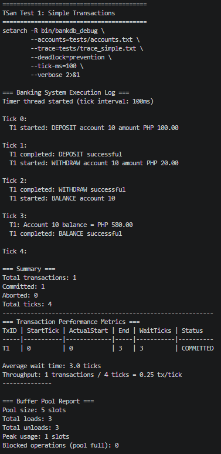
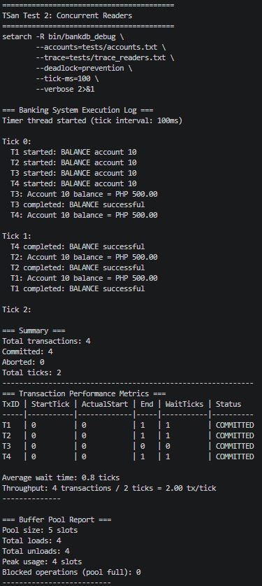
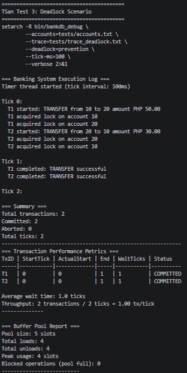
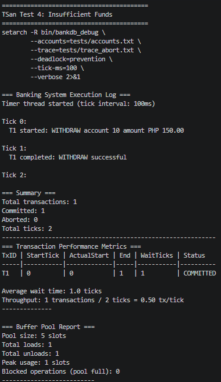
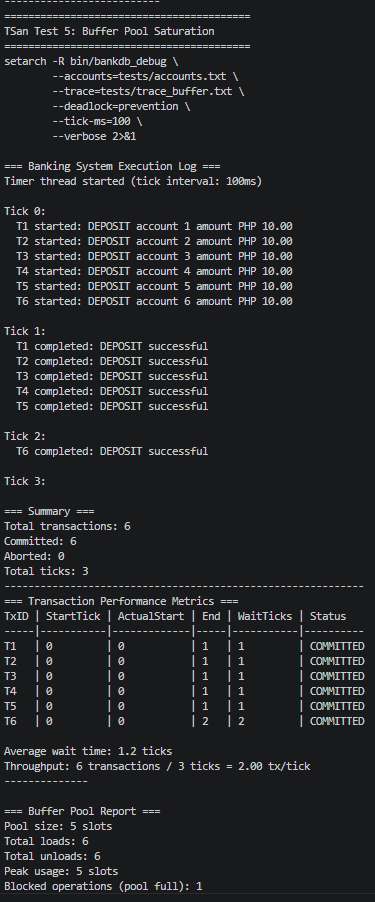
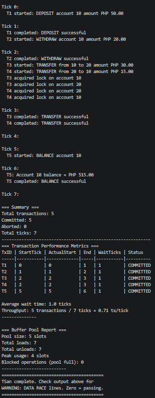

# CMSC 125 | Concurrent banking

## Contributors
Mark Leonel T. Misola (Xenon5443)\
Francis Eugene Kho Young (YoungFEK)

## Solution Architecture
### Header Files:
**bank.h**
- Struct that will be used for storing the balance and accounts in centavos
- Lock is used for the account itself, to avoid multiple threads editing an account at the same time
- Lock is also used in the bank to avoid accounts overwriting each other
**buffer_pool.h**
- This contains structures that stores account information for transaction operation to solve producer-consumer concurrency problem

**lock_mgr.h**
- Connecting functions from lock manager to other functions when using locks

**metrics.h**
- Contains function header for printing in the metric source file

**transaction.h**
- Includes type of operations as enums
- Transaction will be used to store operation instructions as transaction struct composes of multiple operations
- Each transaction will have a status at the end of execution

**timer.h**
- Has the global time that will be used to synchronize transaction for the bank

### Source Files:
**main.c** 
- Parses input from the command line, 
- Tokens generation help identify the trace file which will be passed to utils.c, the deadlock method which is prevention, and milliseconds per tick
- Uses tokens to tell it from which file are the initial account balances, and it loads these initial account balances into the account struct

**bank.c**
- Contains specific account operations/functions to be called transaction.c

**buffer_pool.c.**
- Solved the consumer-produce and will implemented in week 3

**lock_mgr.c**
- Specific functions in transfer operation relating to handling locks are placed here

**metrics.c** 
- Print metrics such as actual time, start time, wait time, which are execution information for each transaction

**transaction.c**
- Receives the transaction struct or information and executes by calling methods from bank.c

**timer.c**
- Timer thread will run from the start of bank execution to track global time
- This will be used to simulate concurrency problems that should be resolved by the system
- Wait until tick function from this header file will be used to pause transactions for the simulation

**utils.c**
- Parses the trace file, splits and obtains the necessary information for each transaction
- Based on the transaction information, it passes the tokens to main.c and main.c calls transaction.c

### Design.md Documentation
## 1. Deadlock Strategy Choice
**Which strategy did you choose (prevention or detection)?**
Deadlock prevention via Lock ordering

**Why did you choose this strategy?**
From Arpaci-Dusseau OSTEP book on the topic of common concurrency problems used in problem set 2, this is the most straight forward way to break circular wait.
This laboratory is simple enough to allow a basic implementation of deadlock prevention which is also another problem mentioned in the book where it is difficult to implement this kind of prevention for complex systems.
Deadlock Detection via Wait-For Graph is a detect and recover approach which is a resource intensive approach because it continuously check for cycles that indicates deadlock
The note also states that this will be more simple to implement as we do not have the capability and time resources to implement the more complicated option

**If prevention: Prove that lock ordering eliminates circular wait. Which Coffman condition is broken?**
Circular wait is the condition that Deadlock prevention via Lock ordering prevents. This happens because it ensures that the lowest value lock ID is the one that the thread will use first avoiding both transaction thread on waiting for each other. Without ordering, these threads can get hold of 2 unique keys from each of the account which will result in deadlock wherein both threads are waiting for each other’s keys. Ordering eliminates circular wait by starting with the key with lowest ID rather than letting the OS choose one arbitrarily.

## 2. Buffer Pool Integration
**When do you load accounts into the buffer pool? When do you unload them?**
Accounts are loaded and unloaded at the beginning of each specific bank operation. For instance, an account is loaded into the buffer pool at the beginning of the “get_balance” function and unloaded at the end of the function.

**What happens if the pool is full when a transaction needs an account?**
If the pool is full when a transaction needs an account, then the execution of the bank operation in the transaction is put on hold. Specifically, the load_account function which is called in the bank operation is blocked until a slot in the pool becomes available.

**Justify your design with reasoning about performance and correctness**
We chose our design to as much as possible minimize the amount of time an account spends in the buffer pool. Once a transaction does what it needs to with an account then the account is removed from the buffer pool. Generally, we also used the buffer pool to limit the amount of transactions processed at a given time.

## 3. Reader-Writer Lock Performance

## Show benchmark results comparing pthread_mutex_t vs pthread_rwlock_t

<!-- **Image 1 Pthread_mutex_t benchmark.** -->
## Image 1 Pthread_mutex_t benchmark.

## Image 2 pthread_rwlock_t benchmark.

Image 1 shows that implemented control or restriction to a shared resource especially when the number of accounts surpasses the maximum number of slots of a buffer pool. Image 2 is the benchmark data of pthread_rwlock_t. It is seen that multiple threads are overlapping which is seen in “Peak usage”, actual start, and end.

On which workload (trace file) does rwlock show the biggest improvement?
trace_readers.txt , since all the operations are getting the balance of an account which rely on a thread reading it. Furthermore, the starting tick of all these operations are the same, hence reading will be done concurrently.

Why does rwlock help on read-heavy workloads?
rwlock allows multiple threads to read simultaneously. It only restricts access to a single thread for write operations.

## 4. Timer Thread Design
Why is a separate timer thread necessary?
To keep track of time while the bank process is running and synchronize transaction
This would also allow us to record metrics for more insight on how the system work
What would break if you removed the timer and processed operations sequentially?
The order in which transactions executed would not be followed, which means that the result will be unpredictable and unreliable in testing for concurrency problems.
How does the timer thread enable true concurrency testing?
It simulates concurrency problems such as trying to force race conditions within the banking system similar to what might happen in real banking systems
From the testing inputs, it forces transactions to be processed in the same tick

## Test cases 1-6/TSan-clean run

## Timeline
| Week Number | Objective |
|---|---|
| Week 1 | Design document and initial planning for laboratory |
| Week 2 | Implement foundation of basic operations and code structure |
| Week 3 | Implement transfer operation, deadlock solution and buffer pools |
| Week 4 | Refactors, optimization and final defense |
